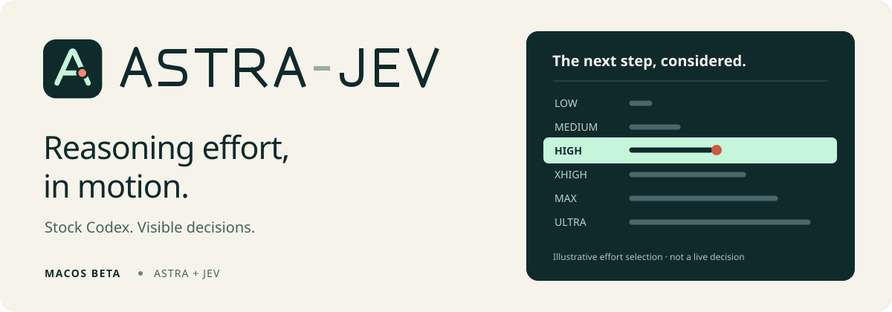

<p align="center">
  
</p>

**Let Jev choose how hard Astra thinks.** Astra-Jev adjusts reasoning effort as your task progresses, while keeping the stock Codex interface, tools and permissions.

macOS beta · Node 22.19+ · Your Codex account + your TypeSafe API key

## Get started

Install stock Codex and sign in with an account that has GPT-6 Astra access. Then install the latest published archive:

```sh
npm install --global --ignore-scripts 'https://github.com/brunocfalcao/astra-jev/releases/download/v1.0.1-rc.1/astra-jev-1.0.1-rc.1.tgz'
astra-jev-control setup
astra-jev-control doctor
```

During setup, type **YES** to accept the [data flow](PRIVACY.md), then paste **your own TypeSafe API key** into the hidden prompt. Codex sign-in does not supply this key. Doctor checks connectivity and can make a billable Jev request.

Open a terminal in your project and run:

```sh
astra-jev
```

Restart after updating. See the [release notes](https://github.com/brunocfalcao/astra-jev/releases) for validation and known limits.

## Everyday use

```sh
astra-jev resume         # Pick a conversation
astra-jev resume --last  # Continue the last conversation
```

Work normally in Codex. Jev adapts Astra's effort at supported local-tool checkpoints. In the resume picker, Enter resumes; Esc starts fresh.

Use `/model` to switch models. Jev pauses for other models and resumes when you return to Astra. Codex keeps control of permissions.

Routine effort changes stay quiet. Model transitions and evaluator failures remain visible; decisions remain available in status and logs.

## Settings and usage

Ask the bundled Codex skill in plain language:

```text
$astra-jev show this project's settings
$astra-jev check whether Jev and Astra are working
```

Or use the terminal:

```sh
astra-jev-control config
astra-jev-control config set fixedEffort high
astra-jev-control config set fixedEffort null
astra-jev-control status --table
```

`high` fixes Astra's effort; `null` restores Jev. Restart for settings to take effect. Run the usage table from the same project folder you launched in. It shows recorded tokens for adaptive Jev, fixed effort and other models, without contacting providers.

**Experimental:** adaptation does not guarantee lower costs or better answers. Resumed sessions adapt at supported checkpoints, but native effort capture and Astra token counts are unavailable. Incomplete usage totals are lower bounds.

## Details and troubleshooting

### Project settings

The first launch creates `astra-jev.json`; existing files are preserved.

| Setting | Default | Effect |
| --- | --- | --- |
| `enabled` | `true` | Enable the managed integration. |
| `fixedEffort` | `null` | Use Jev, or choose `low`, `medium`, `high`, `xhigh`, `max`, `ultra`. |
| `requireJev` | `false` | Refuse fixed/direct launches and non-Astra selection; stop on evaluator or effort-publication failure. |
| `verbose` | `true` | Control routine notice generation; the native TUI hides routine effort notices either way. |

Add `--cwd PATH` to configuration commands to target another project. Legacy `resumePermissions` and `noAltScreen` settings are ignored. Use native Codex controls for permissions and `--no-alt-screen` for inline rendering.

### Status

```sh
astra-jev-control status --list
astra-jev-control status --thread THREAD_ID
```

Inside a managed conversation, `astra-jev-control status` uses the current thread. Recorded status is historical evidence, not a liveness check. A selected or published effort is not proof that Codex captured it. “Jev: responding” describes the last successful evaluator request, not the whole turn's health.

Project totals require logs created after project attribution was added. Older logs are excluded with a count. Active turns, resumed sessions, other-model usage and missing provider usage can be incomplete. Cached input is already included in input tokens; combined totals include Jev overhead. Retain logs to retain history. Symlink aliases share a project; subfolders and moved folders are separate.

Ordinary sessions do different work and cannot establish savings. The source checkout's `scripts/cost-benchmark.mjs` runs paired synthetic tasks; see [benchmark guidance](docs/1.0-READINESS.md). The usage table accepts only complete, paired reports attributed to that project under `verification/benchmark-TIMESTAMP/`. Differences include Jev overhead and can be negative. Tokens are not dollars.

### Compatibility and limits

All `astra-jev` arguments belong to Codex. Use `astra-jev-control` for wrapper diagnostics. Codex upgrades are allowed without version validation; report integration failures through [issues](https://github.com/brunocfalcao/astra-jev/issues).

Unsupported invocations—including `exec`, `review`, external remote sessions, profiles and worktrees—run stock Codex directly. Explicit permission overrides on resume also use stock Codex. `requireJev: true` blocks these fallbacks. A missing Jev key cancels an adaptive launch.

One managed session owns one thread. Hosted tools, some asynchronous continuations and child threads are outside checkpoint coverage. Fresh-session leases count native generations; resumed sessions reassess each supported checkpoint and can call Jev more often. See [architecture](docs/ARCHITECTURE.md) and [compatibility](docs/COMPATIBILITY.md).

### Skill, updates and removal

Setup and managed launches install the bundled skill, preserving personal edits. If missing, run `astra-jev-control install-skill`, then restart Codex.

Update using the archive linked in the latest reviewed release, then restart Astra-Jev. Uninstall with `npm uninstall --global astra-jev`. Settings, credentials, logs and the installed skill remain; optional cleanup is documented in [privacy](PRIVACY.md).

### Development

```sh
npm ci --ignore-scripts
npm run check
npm run pack:check
npm run test:install
```

Checks use synthetic fixtures without service credentials. Native integration and independent clean-Mac proof are separate gates; clean-Mac proof remains pending.

[Contributing](CONTRIBUTING.md) · [Release procedure](docs/RELEASING.md) · [Walkthrough](docs/DEMO.md) · [Security reporting](SECURITY.md) · [Changelog](CHANGELOG.md)

MIT licensed. Inspired by [Astra-Ares](https://github.com/miuuyy/Astra-Ares); see [third-party notices](THIRD_PARTY_NOTICES.md). Not affiliated with OpenAI or TypeSafe.
